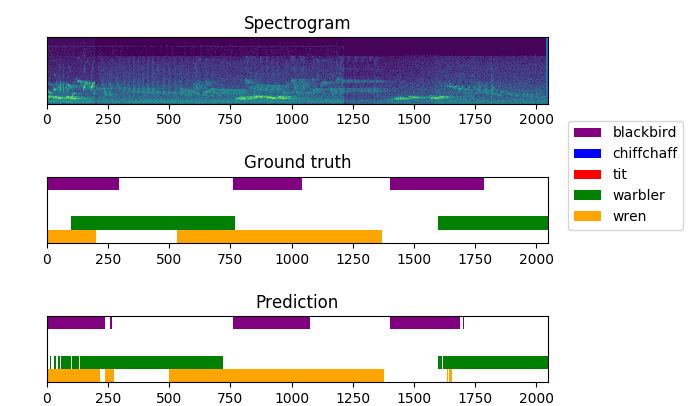

# Polyphonic Bird Sound Event Detection


This repository contains the data and code for reproducing the results reported my work 
["Polyphonic Bird Sound Event Detection With
Convolutional Recurrent Neural Networks"](https://drive.google.com/open?id=1726Uo_Y1skX0ebFjR9_exTwcgOU0c5Hl).
 
The network architecture was inspired by [sednet](https://github.com/sharathadavanne/sed-crnn/blob/master/README.md).    
The dataset is called UvABirds and contains 3200+ annotations of bird songs. 

# Download links 
annotations: 
[Google drive](https://drive.google.com/open?id=1eM9z5Z_GJgSHrhZjhTvamj6V_gYoF0k9)
     

| Species    	| Number of songs annotated 	|
|------------	|---------------------------	|
| Chiffchaff 	| 883                       	|
| Great tit  	| 796                       	|
| Blackbird  	| 566                       	|
| Warbler    	| 503                       	|
| Wren       	| 500                       	|
| Total      	| 3248                      	|

audio files: 
[Google drive](https://drive.google.com/open?id=1rm0KpcpQgd3gXQO_oeLWcLSzFrdKyj-i)

trained network:
[Google drive](https://drive.google.com/open?id=17OSyrQj6TCPiIVYseeSv_HrlEgKk0ptW)   
This network achieves a frame-wise F-score of 0.94 and an error rate of 0.11 on three concurrent sound events.    
The networks input feature hyperparameters are as follows:    
sequence length = 512 frames (approximately 12 seconds).    
sample rate = 44100Hz    
stft window length = 512 wave points   

An audible example of the networks predictions can be found [here (Youtube)](https://www.youtube.com/playlist?list=PLcJ_PpkRNLbGds9A_qoV077HOoZ-0GT_L).


# How to train 
Install the libraries in the requirements.txt. When using GPUs, make sure to use the right CUDA and CUDNN versions for tensorflow 1.13.1.      

Create feature files by running:
``` 
python3 features.py --audios_directory ~/audio_dir_here \
                         --annotations_directory' ~/annotation_dir_here \
                         --output_directory ~/output_dir_here \
                         --sequence_length 512 \
                         --sample_rate 44100 \
                         --window_length 512 \
                         --hop_length 256
```
Then, set the feature directory in `train_sed.py` and train the network by running: 
` python3 train_sed.py `.

# Model inference
To use a trained model, use the SEDgenerator to prepare samples and feed them to the model by using      
`prediction = model.predict(sample)` 
   


